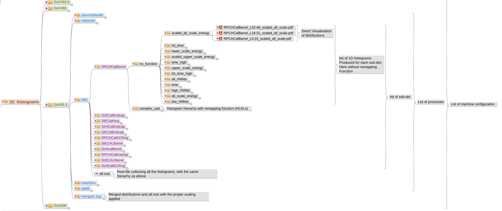

# The Histogram hierarchy 
The 1D histograms hierachy visible below is produced by processing the simulated files.
.

The 2D histograms will be a reproduction of the 1D histograms where distributions of subdetectors are combined, 
to produce global pictures.

The hierarchy follows the following pattern:
- top = 1 entry per machine configurations (e.g. beam energy)
  - second: 1 entry per process (including machine backgrounds) plus the merged_log (log stands for logarithmics display)
    - third: 1 entry per sub-detector, plus the ROOT file __all.root__ containing all the histograms from this level and below
      - fourth: the direct mapping (no_function) or modified ones
        - fiveth: the type of distributions
          - sixth: the pdf files of the distrubutions, for all grouping applied (e.g. layer or tower grouping)
        
